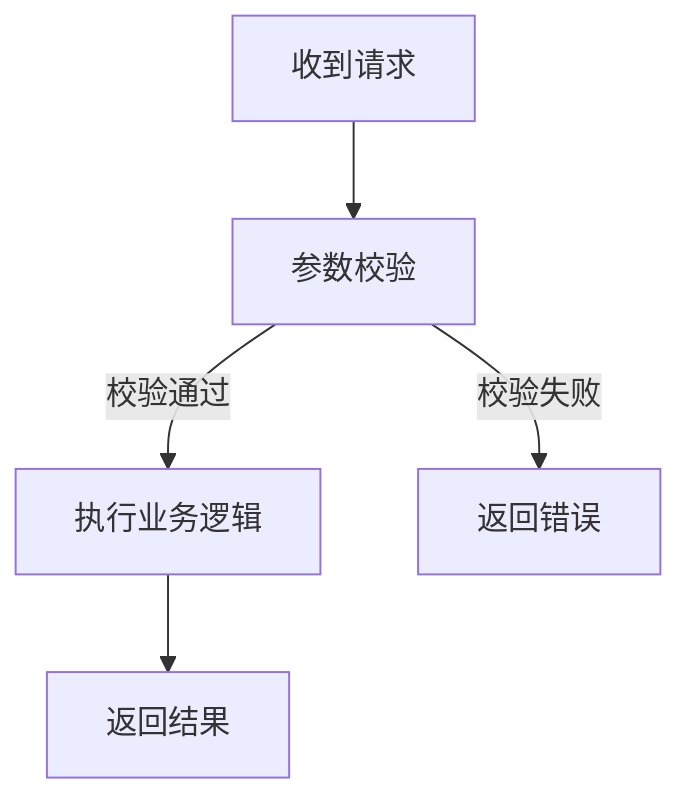

> 此文件为纯模板，可按需修改。Skill 文件会引用此模板。
> 标记为引用（`>`）的内容是给 AI 的指令（提示词），必须理解并遵守其要求，但不要直接复制到生成的文档里。

---

# 第一模块：接口描述

## 1. 接口概述

> 以下表格行数不固定，可根据实际需要增删行（如增加"请求域名""接口版本"等）。

| 项目         | 说明                                                    |
| ------------ | ------------------------------------------------------- |
| 接口名称     | 接口功能描述                                            |
| 接口路径     | /module/path                                            |
| 请求方式     | POST/GET/PUT/DELETE                                     |
| 返回格式     | JSON                                                    |
| 所需权限     | 权限标识（如 admin:product:update），无权限控制则填"无" |
| 是否需要分页 | 是/否（如果是，请注明支持分页查询）                     |

## 2. 请求参数

### 2.1 请求体参数

```json
{
  "field1": "value1",
  "field2": "value2"
}
```

### 2.2 请求字段说明

| 字段      | 类型 | 必填  | 说明     |
| --------- | ---- | ----- | -------- |
| fieldName | Type | 是/否 | 字段说明 |

## 3. 响应格式

```json
{
  "field1": "value1",
  "field2": "value2",
  "code": 200,
  "msg": "操作成功"
}
```

### 3.1 响应字段说明

| 字段      | 类型   | 说明                |
| --------- | ------ | ------------------- |
| fieldName | Type   | 字段说明            |
| code      | int    | 状态码，200表示成功 |
| msg       | string | 提示信息            |

## 4. 枚举定义（如适用）

> 有用到枚举才列出来

| 编码      | 名称     | 说明     |
| --------- | -------- | -------- |
| ENUM_CODE | 枚举名称 | 说明描述 |

---

# 第二模块：后端开发相关描述

## 1. 控制层与Service实现

### 1.1 控制层代码位置

文件路径：`项目包路径/controller/XXXController.java`（示例：com.zbkj.admin.controller.merchant.MerchantIntegralProductController.java）

### 1.2 控制层代码示例

```java
/**
 * 控制层接口类（示例）
 */
@RestController
@RequestMapping("/api/admin/platform/integral/product")
public class MerchantIntegralProductController {

    @Autowired
    private IntegralShoppingService integralShoppingService;

    /**
     * 接口功能描述（示例：批量上下架积分商品）
     * @param params 请求参数
     * @return 统一响应结果
     */
    @PostMapping("/batch/update/show")
    public Result<Object> batchUpdateShow(@RequestBody BatchRequest params) {
        // 控制层逻辑简洁，直接调用Service方法
        return integralShoppingService.batchUpdateShow(params);
    }
}
```

### 1.3 Java Service 实现

```java
/**
 * Service 接口
 */
public interface IntegralShoppingService {
    Result<Object> batchUpdateShow(BatchRequest params);
}

/**
 * Service 实现类
 */
@Service
public class IntegralShoppingServiceImpl implements IntegralShoppingService {

    @Autowired
    private ProductDao productDao;

    @Override
    public Result<Object> batchUpdateShow(BatchRequest params) {
        // 1. 构建查询条件（参数校验、合法性判断）
        if (CollectionUtils.isEmpty(params.getIds())) {
            return Result.fail("请选择需要操作的商品");
        }
        // 2. 执行业务逻辑（批量更新状态等）
        int count = productDao.batchUpdateShow(params.getIds(), params.getStatus());
        // 3. 转换数据并填充响应结果
        Map<String, Object> result = new HashMap<>();
        result.put("successCount", count);
        result.put("failCount", params.getIds().size() - count);
        // 4. 返回统一格式响应
        return Result.success(result, "操作成功");
    }
}
```

## 2. 查询相关说明

> 按实际使用的查询方式填写，不要同时写两种。
>
> - **单表操作**（BaseMapper / LambdaQueryWrapper）：简单说明用了哪个方法即可，做了什么查询。
> - **多表/复杂查询**（自定义 XML）：列出 Mapper 方法 + XML 语句，越复杂越要详细解释。

```java
// 单表示例：简单说明
LambdaQueryWrapper<Product> wrapper = new LambdaQueryWrapper<>();
wrapper.eq(Product::getShowStatus, 1);
productMapper.selectPage(page, wrapper);
```

```xml
<!-- 多表/复杂查询示例：列出完整 XML 并解释 -->
<?xml version="1.0" encoding="UTF-8"?>
<!DOCTYPE mapper PUBLIC "-//mybatis.org//DTD Mapper 3.0//EN" "http://mybatis.org/dtd/mybatis-3-mapper.dtd">
<mapper namespace="com.zbkj.service.mapper.ProductMapper">

    <update id="batchUpdateShow" parameterType="java.util.Map">
        UPDATE table_name
        SET show_status = #{status}
        WHERE id IN
        <foreach collection="ids" item="id" open="(" separator="," close=")">
            #{id}
        </foreach>
    </update>

</mapper>
```

```java
public interface ProductMapper extends BaseMapper<Product> {
    int batchUpdateShow(@Param("ids") List<Long> ids, @Param("status") Integer status);
}
```

> 复杂 XML 要给出适当解释

## 3. 关键实现说明

> 若接口不只是单纯的 CRUD，使用了特殊组件或非标准方法（如定时任务、Redis 缓存、消息队列、分布式锁、异步处理、第三方调用等），需在此逐一说明。仅做常规增删改查则填"无"。

## 4. 执行流程

> 用图文结合的方式说明接口的完整执行链路，方便快速理解接口做了什么，它的执行逻辑是什么样的。

### 4.1 流程图（Mermaid）



### 4.2 执行步骤说明

## 5. 数据库相关说明

> 填写规则（按涉及的表逐张判断）：
>
> - 若表已存在（有 Entity 实体类）→ 填入 5.1 表信息概览 + 5.2 详细表结构
> - 若表尚不存在（无 Entity 类）   → 不填 5.1/5.2，由 AI 根据需求在 5.3 中给出建表 DDL 脚本
> - 示例：接口涉及 3 张表，其中 2 张已存在、1 张待建 → 5.1/5.2 列出已存在的 2 张表，5.3 给出待建表的 DDL
> - 示例：接口涉及的表全部存在 → 只填 5.1 + 5.2，不填 5.3
> - 示例：接口涉及的表全部待建 → 5.1/5.2 留空，只填 5.3

### 5.1 表信息概览

| 序号 | 表名       | 用途   |
| ---- | ---------- | ------ |
| 1    | table_name | 表用途 |

### 5.2 详细表结构

> 因 AI 无数据库连接权限，表结构可根据项目中 Java 实体类 (Entity/POJO) 字段来整理成表格。

#### 表名：table_name（表说明）

| 字段名 | 字段类型              | 默认值 | 备注（说明）   |
| ------ | --------------------- | ------ | -------------- |
| id     | bigint auto_increment | 无     | 主键ID（主键） |

### 5.3 SQL 脚本

> 仅当存在需要新建的表时才填写此节。根据需求给出建表 DDL。

```sql
CREATE TABLE table_name (
    id BIGINT AUTO_INCREMENT PRIMARY KEY COMMENT '主键ID',
    create_time DATETIME DEFAULT CURRENT_TIMESTAMP COMMENT '创建时间',
    update_time DATETIME DEFAULT CURRENT_TIMESTAMP ON UPDATE CURRENT_TIMESTAMP COMMENT '更新时间'
) ENGINE=InnoDB DEFAULT CHARSET=utf8mb4 COMMENT='表说明';
```
